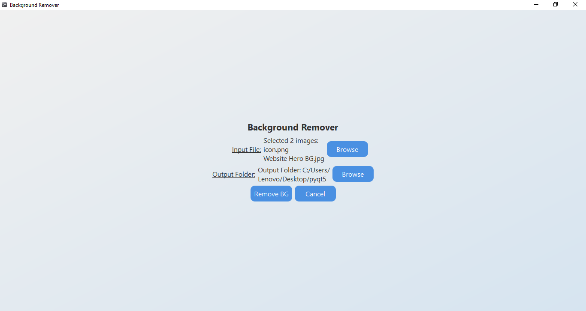
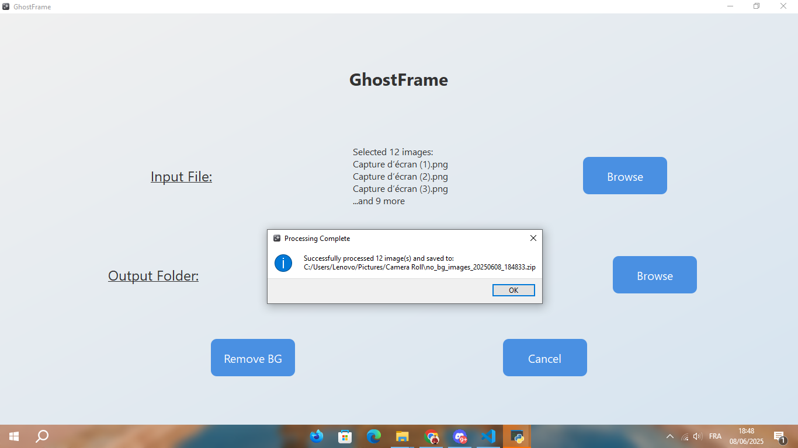

<p align="center">
  
</p>

<h1 align="center">🖼️ GhostFrame </h1>

A simple desktop application that removes backgrounds from images using AI, powered by `rembg` and built with PyQt5.  
Select multiple images, choose an output folder, and process them all with a single click!

---

## ✨ Features

- 🖼️ Batch image selection (JPG, JPEG, PNG)  
- 🤖 Automatic background removal using `rembg` (runs **locally**, **no internet required**)  
- 📁 Custom output folder  
- 🗜️ ZIP compression for multiple results  
- 📦 Clean, user-friendly PyQt5 interface  
- 🧊 Icon support (custom window icon)  

---

## 📸 Preview


<br>


---

## 📂 Project Structure

```plaintext
GhostFrame/
├── main.py           # Python script (the app)
├── gui.ui            # UI layout file from Qt Designer
├── icon.png          # App window icon
├── screenshots/      # Screenshots for GitHub preview
├── requirements.txt  # List of required Python packages
└── README.md         # This file

```

## 🧰 Requirements

- Python 3.7 to 3.10 (some packages may not support Python 3.11+ yet)  
- PyQt5  
- rembg  
- Pillow (PIL)

## 🚀 Installation

1. Clone this repository or download the source files:

```bash
git clone https://github.com/your-username/background-remover-gui.git
cd background-remover-gui
```


2. Install the required packages:
```bash
pip install -r requirements.txt
```
3. Run the application:
```bash
python main.py
```
4.Enjoy! 🎉